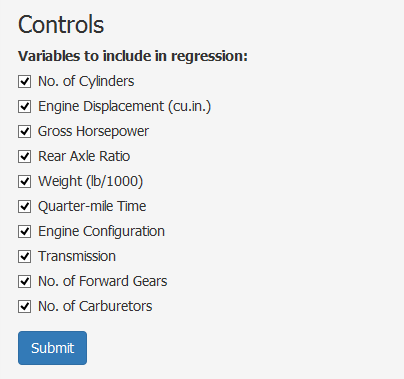

<style>
.title-slide {
    background-image: url(./assets/img/cars.jpg);
    background-repeat: no-repeat;
    background-position: center center;
    background-size: cover;
}
.title-slide hgroup > h1{
    color: #7A378B
}
.title-slide hgroup > h2{
    color: #FFFFFF
}
.title-slide hgroup > p{
    color: #FFFFFF
}
</style>

## Introduction

> * This is a slidify presentation created to pitch the use of the MTCARS Regression Shiny App.
> * This is a shiny app that is based on the course project for the Regression Models class in the Data Science Specialisation on Coursera.
> * This shiny app enhances the interactivity of that course project by allowing users to choose different combinations of variables to include in the regression analysis.
> * The App may be found at [https://nicholasng.shinyapps.io/Class-9-Course-Project/ ] (https://nicholasng.shinyapps.io/Class-9-Course-Project/).

---  

## The Course Project

> * The course project required students to study the relationships between the `mpg` variable and the other variables in the `mtcars` data set.
> * By studying the relationships between the variables, students were then required to find the optimal combination of regressors that best describes the factors leading to a higher Miles Per Gallon (MPG) rating of a car.
> * In my shiny app, users may conduct a similar study and determine the best combination of variables to include by allowing control over the inclusion/exclusion status of variables.

---

## Controls

> * To include/exclude variables, users simply have to either check/uncheck the checkboxes under the "Controls" section in the sidebar.  

> * Once the submit button is clicked, the server script will determine which checkboxes have been selected and re-run the regression script.

---

## Output

* Once the user clicks on the submit button, there will be an output of the formula, the summary statistics as well as the diagnostics, similar to the below:  
```{r regression, echo=FALSE}
model_chosen <- lm(mpg ~ ., data = mtcars)
summary(model_chosen)
```
