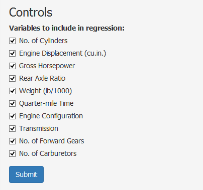

<style>
.title-slide {
    background-image: url(./assets/img/cars.jpg);
    background-repeat: no-repeat;
    background-position: center center;
    background-size: cover;
}
.title-slide hgroup > h1{
    color: #7A378B
}
.title-slide hgroup > h2{
    color: #FFFFFF
}
.title-slide hgroup > p{
    color: #FFFFFF
}
</style>

## Introduction

> * This is a slidify presentation created to pitch the use of the MTCARS Regression Shiny App.
> * This is a shiny app that is based on the course project for the Regression Models class in the Data Science Specialisation on Coursera.
> * This shiny app enhances the interactivity of that course project by allowing users to choose different combinations of variables to include in the regression analysis.
> * The App may be found at [https://nicholasng.shinyapps.io/Class-9-Course-Project/ ] (https://nicholasng.shinyapps.io/Class-9-Course-Project/).

---  

## The Course Project

> * The course project required students to study the relationships between the `mpg` variable and the other variables in the `mtcars` data set.
> * By studying the relationships between the variables, students were then required to find the optimal combination of regressors that best describes the factors leading to a higher Miles Per Gallon (MPG) rating of a car.
> * In my shiny app, users may conduct a similar study and determine the best combination of variables to include by allowing control over the inclusion/exclusion status of variables.

---

## Controls

> * To include/exclude variables, users simply have to either check/uncheck the checkboxes under the "Controls" section in the sidebar.  

> * Once the submit button is clicked, the server script will determine which checkboxes have been selected and re-run the regression script.

---

## Output

* Once the user clicks on the submit button, there will be an output of the formula, the summary statistics as well as the diagnostics, similar to the below:  

```
## 
## Call:
## lm(formula = mpg ~ ., data = mtcars)
## 
## Residuals:
##     Min      1Q  Median      3Q     Max 
## -3.4506 -1.6044 -0.1196  1.2193  4.6271 
## 
## Coefficients:
##             Estimate Std. Error t value Pr(>|t|)  
## (Intercept) 12.30337   18.71788   0.657   0.5181  
## cyl         -0.11144    1.04502  -0.107   0.9161  
## disp         0.01334    0.01786   0.747   0.4635  
## hp          -0.02148    0.02177  -0.987   0.3350  
## drat         0.78711    1.63537   0.481   0.6353  
## wt          -3.71530    1.89441  -1.961   0.0633 .
## qsec         0.82104    0.73084   1.123   0.2739  
## vs           0.31776    2.10451   0.151   0.8814  
## am           2.52023    2.05665   1.225   0.2340  
## gear         0.65541    1.49326   0.439   0.6652  
## carb        -0.19942    0.82875  -0.241   0.8122  
## ---
## Signif. codes:  0 '***' 0.001 '**' 0.01 '*' 0.05 '.' 0.1 ' ' 1
## 
## Residual standard error: 2.65 on 21 degrees of freedom
## Multiple R-squared:  0.869,	Adjusted R-squared:  0.8066 
## F-statistic: 13.93 on 10 and 21 DF,  p-value: 3.793e-07
```
